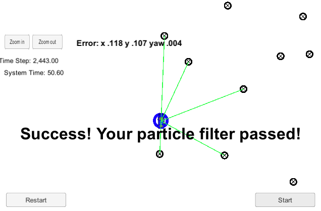

# Kidnapped Vehicle Project
Udacity Self-Driving Car Engineer Nanodegree Program: Term 2
[Master project repo](https://github.com/udacity/CarND-Kidnapped-Vehicle-Project)

This project implements a particle filter to help a robot vehicle determine its location from (noisy) sensor and control data. The vehicle is provided with a map of landmarks, an initial rough position (such as would be provided by GPS), and a stream of sensor measurements corresponding to the range to nearby landmarks.

This project uses the Term 2 Simulator which can be downloaded [here](https://github.com/udacity/self-driving-car-sim/releases).

## Project structure

The project consists of the following primary components:
* src/main.cpp - Responsible for interfacing with the simulator and reading (simulated) lidar measurement data
* src/particle_filter.cpp, .h - Responsible for implementing the particle filter and holding all values associated with it
* src/helper_functions.h - Holds various ancillary helper functions

## Particle filter concepts

The PF works by initializing an ensemble of "particles" that represent possible true positions and orientations of the vehicle. These are distributed based on the approximate starting position from GPS, and the estimated location error.

For each set of sensor measurements, the filter performs the following analysis chain for each particle. It first propagates the particle to a new position, based on that particle's starting position, velocity, yaw, and yaw rate. It then transforms the observed measurements - which are in the form of the distance of landmarks relative to the vehicle - to a position on the map, assuming the true position is that of the particle (as updated). 

It next associates each observed measurement with a landmark, using a simple nearest-neighbor approach. Then it calculates the probability of this set of observed measurements, using a multi-variate gaussian function of the displacement or offset between the measurements and the landmarks. 

Finally, the filter resamples (with replacement) the ensemble of particles using these probabilities (known as "weights"). This new, resampled ensemble consists of the same number of particles, although there may be duplicates. Over time, the number of distinct particles shrinks to a small number tightly localized around the true position of the vehicle.

## Relation to Bayes' Rule

The PF is essentially a discretized probability distribution of the vehicle's position and orientation. This distribution goes through a prediction step, followed by an update step based on sensor measurements. The resampling step essentially concentrates probability density, by preferentially sampling higher-likelihood particles multiple times.

## Filter performance

The filter performed quite well with various total numbers of particles. At low values of particle number (< 50) there was a significant trade-off between particle number and error, but using more than 50 particles did not seem to improve the performance very much. Amazingly, the filter displayed tolerable error rates with as few as 3 particles! (It failed for 2 and 1 particles, unsurprisingly.)

Since the algorithm is stochastic (random Gaussian noise is added at various steps, and the resampling is stochastic) the results were slightly different each time. The table below summarizes representative values.

| Particle # | x err | y err  | yaw err | Time (s) | 
|:----------:|:-----:|:------:|:-------:|:--------:|
| 200        | 0.111 | 0.104  | 0.004   | 50.60    |
| 100		 | 0.118 | 0.107  | 0.004   | 50.60    | 
| 50         | 0.119 | 0.111  | 0.004   | 49.66    |
| 25		 | 0.130 | 0.124  | 0.004   | 50.08    |
| 12         | 0.153 | 0.141  | 0.005   | 50.28    |
| 6          | 0.192 | 0.182  | 0.006   | 49.96    |
| 3          | 0.318 | 0.277  | 0.009   | 50.32    |
| 2          | N/A   | N/A    | N/A     | N/A      |
